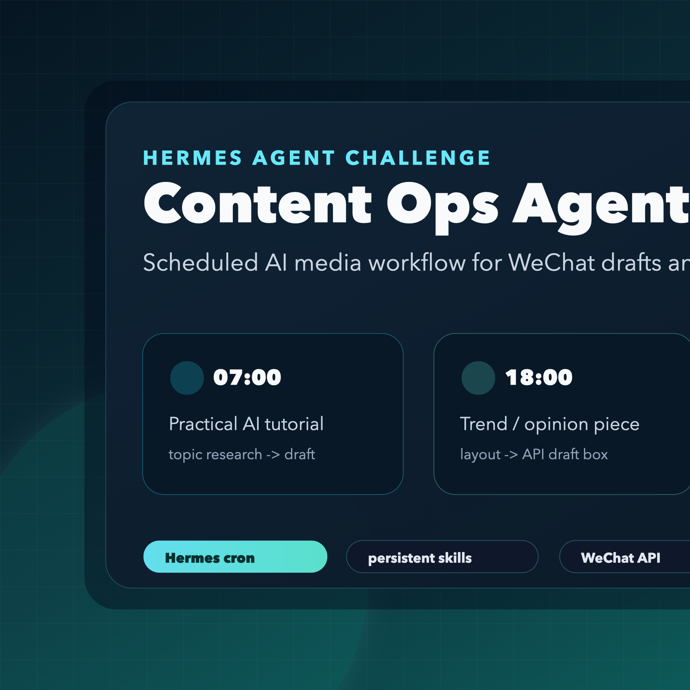
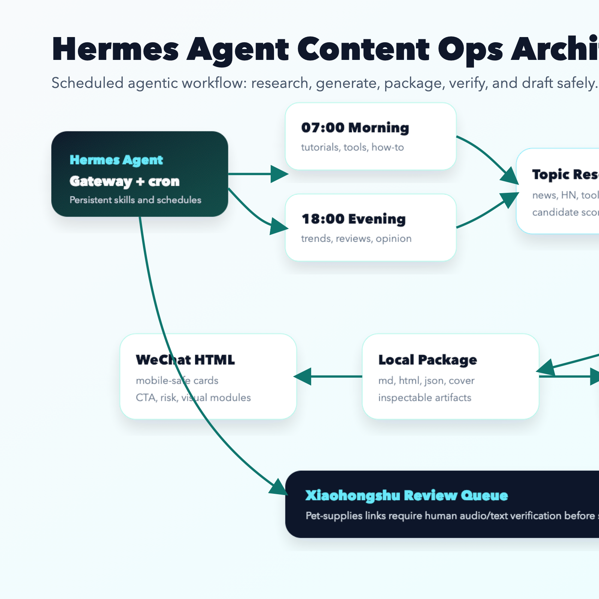
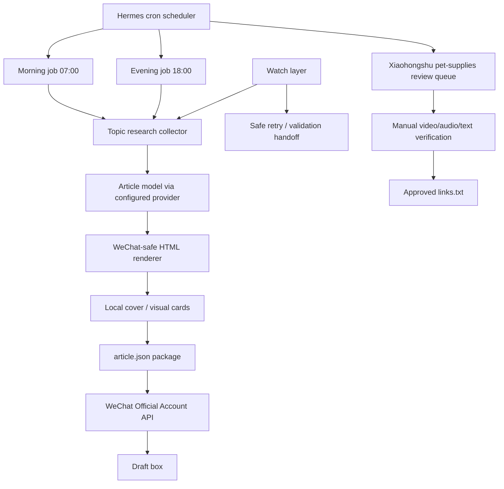

# Hermes Agent Content Ops

An open-source reference implementation for safe, scheduled AI content
operations. It combines recurring research, draft generation, event-aware
wakeups, package validation, and human review gates for publishing workflows.



The included implementation uses WeChat Official Account drafts and a
Xiaohongshu research queue as concrete examples. The watch layer and audit
helpers are platform-independent building blocks that can be adapted to other
content systems.

The repository began as a DEV Hermes Agent Challenge submission. It is now
maintained as a reusable public project; the original submission notes remain
in the repository as project history.

## Quick Start

Requirements:

- Python 3.10 or newer
- No third-party Python packages for the public samples and tests

```bash
git clone https://github.com/kax168/hermes-agent-content-ops.git
cd hermes-agent-content-ops
python3 -m unittest discover -s tests
python3 scripts/run_finish_audit.py
python3 scripts/watch_content_events.py examples/watch-package \
  --out examples/watch-report.json
```

The sample commands do not publish content or require private credentials.

## What It Does

- Runs two scheduled WeChat article pipelines every day: 07:00 and 18:00 Asia/Shanghai.
- Adds an event-aware watch layer so important changes can wake the agent between cron slots.
- Searches current web/news/community sources before selecting a topic.
- Produces a full article package: topic research, Markdown backup, WeChat-safe HTML, local cover image, image plan, and JSON payload.
- Creates a real WeChat Official Account draft through the official WeChat API.
- Keeps publishing disabled by default unless explicitly configured.
- Generates a Xiaohongshu review queue for pet-supplies videos, with human confirmation before links are saved.

## Why Hermes Agent

Hermes is useful here because this is not a single chat completion. It is an operational workflow:

- It needs persistent local skills and account strategy.
- It needs scheduled execution.
- It needs tool use: web research, local file generation, API calls, and delivery reports.
- It needs memory/context: the account positioning, topic rules, layout requirements, and safety constraints persist across runs.
- It needs practical fallbacks when autonomous browser/API flows are unreliable.

## Architecture





## Local Components

The private working installation uses:

- Hermes Agent gateway and cron scheduler.
- A local Hermes skill: `wechat-official-account-operator`.
- Deterministic cron scripts for reliability.
- WeChat Official Account API integration.
- Model provider configuration through environment variables.
- A daily review queue for Xiaohongshu video sourcing.

Private credentials are stored in `~/.hermes/.env` and are not included in this package.

Copy `.env.example` into your deployment environment only when connecting the
samples to real services. Keep auto-publishing disabled until your own review
and rollback controls are in place.

## WeChat Pipeline Output

Each scheduled run writes a package like:

```text
~/.hermes/wechat-mp/YYYY-MM-DD/morning/
  article.md
  article.html
  article.json
  topic_research.md
  image_plan.md
  cover.png
  cover_prompt.txt
```

A successful run only counts if the WeChat API returns a real draft media ID. Otherwise the local package is kept for inspection and the run is reported as failed.

## Event-Aware Watch Layer

Cron is still the baseline scheduler, but the project now includes a lightweight
watch layer for event-driven wakeups. It can detect source research changes,
human review approvals, and WeChat API failures, then decide whether Hermes
should wake for revalidation or a safe retry.

Run the sample watcher:

```bash
python3 scripts/watch_content_events.py path/to/content-package --out watch-report.json
```

See `WATCH_LAYER.md` for the event model.

## Safety Boundaries

- No credential printing.
- No auto-publishing unless `WECHAT_MP_AUTO_PUBLISH=true`.
- No scraping-and-reposting.
- No illegal "freebie" tactics such as account abuse, payment bypasses, cracking, or fake identities.
- No automatic saving of Xiaohongshu video links without human confirmation, because the requirement involves audio-language and on-screen-text judgment.

## Challenge Fit

The original Build With Hermes Agent prompt asked for something useful or
creative where Hermes performs real work at the heart of the project. This
build uses Hermes as the operating layer for a recurring content workflow:
planning, tool use, memory, scheduling, API execution, and status reporting.

## Judging Criteria Mapping

- Effective use of Hermes Agent's agentic capabilities: persistent skill instructions, cron execution, context memory, tool use, API orchestration, and reporting.
- Technical implementation and code quality: deterministic scripts for fragile operations, environment-based secrets, inspectable artifacts, and explicit success/failure checks.
- Creativity and originality: a content-operations agent for WeChat plus a Xiaohongshu product-video research queue.
- Usability and user experience: safe draft-first publishing, redacted/public samples, human-in-the-loop review for ambiguous media checks, and simple output folders for debugging.

## Files In This Submission Package

- `dev-post.md`: English DEV article draft using the challenge template.
- `dev-post-finish-up.md`: GitHub Finish-Up-A-Thon article draft.
- `architecture.mmd`: Mermaid architecture diagram source.
- `submission-checklist.md`: Steps before publishing the DEV submission.
- `BEFORE_AFTER.md`: Completion arc for the finish-up challenge.
- `FINISH_UP_A_THON.md`: Notes on what was finished and how it was verified.
- `WATCH_LAYER.md`: Event-aware wakeup model inspired by community feedback.
- `scripts/run_finish_audit.py`: Public completion audit.
- `scripts/watch_content_events.py`: Public watch-layer sample.
- `tests/test_audit.py`: Standard-library test coverage for the audit.
- `tests/test_watch_layer.py`: Tests for event-aware wake decisions.

## Finish-Up Verification

Run the public quality gates:

```bash
python3 -m unittest discover -s tests
python3 scripts/run_finish_audit.py
```

The audit writes `finish-audit-report.md` and checks that the public package is
complete, documented, and free of obvious credential leaks.

## Project Governance

- Bug reports and feature requests: use GitHub Issues.
- Contributions: see [CONTRIBUTING.md](CONTRIBUTING.md).
- Security reports: follow [SECURITY.md](SECURITY.md).
- Release history: see [CHANGELOG.md](CHANGELOG.md).

Maintainer decisions prioritize credential safety, draft-first publishing,
inspectable artifacts, and human review for ambiguous or irreversible actions.

## License

Licensed under the MIT License. See [LICENSE](LICENSE).
