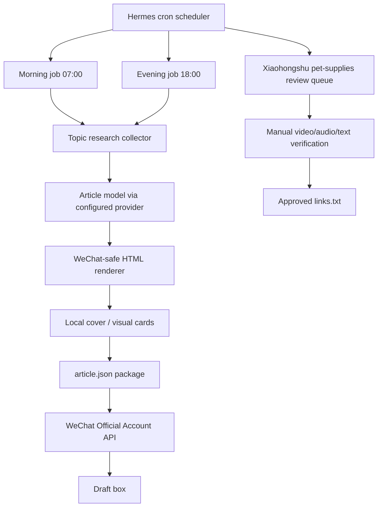

# Hermes Agent Content Ops: Autonomous WeChat + Research Queue

This is a submission package for the DEV Hermes Agent Challenge, Build With Hermes Agent prompt.

The project turns Hermes Agent into a small content-operations system for a Chinese AI/cross-border business media account. It runs scheduled research, topic selection, article generation, WeChat-safe layout, cover creation, and WeChat Official Account draft creation twice a day. It also prepares a daily Xiaohongshu review queue for pet-supplies affiliate video research.

## What It Does

- Runs two scheduled WeChat article pipelines every day: 07:00 and 18:00 Asia/Shanghai.
- Searches current web/news/community sources before selecting a topic.
- Produces a full article package: topic research, Markdown backup, WeChat-safe HTML, local cover image, image plan, and JSON payload.
- Creates a real WeChat Official Account draft through the official WeChat API.
- Keeps publishing disabled by default unless explicitly configured.
- Generates a Xiaohongshu review queue for pet-supplies videos, with human confirmation before links are saved.

## Why Hermes Agent

Hermes is useful here because this is not a single chat completion. It is an operational workflow:

- It needs persistent local skills and account strategy.
- It needs scheduled execution.
- It needs tool use: web research, local file generation, API calls, and delivery reports.
- It needs memory/context: the account positioning, topic rules, layout requirements, and safety constraints persist across runs.
- It needs practical fallbacks when autonomous browser/API flows are unreliable.

## Architecture



## Local Components

The private working installation uses:

- Hermes Agent gateway and cron scheduler.
- A local Hermes skill: `wechat-official-account-operator`.
- Deterministic cron scripts for reliability.
- WeChat Official Account API integration.
- Model provider configuration through environment variables.
- A daily review queue for Xiaohongshu video sourcing.

Private credentials are stored in `~/.hermes/.env` and are not included in this package.

## WeChat Pipeline Output

Each scheduled run writes a package like:

```text
~/.hermes/wechat-mp/YYYY-MM-DD/morning/
  article.md
  article.html
  article.json
  topic_research.md
  image_plan.md
  cover.png
  cover_prompt.txt
```

A successful run only counts if the WeChat API returns a real draft media ID. Otherwise the local package is kept for inspection and the run is reported as failed.

## Safety Boundaries

- No credential printing.
- No auto-publishing unless `WECHAT_MP_AUTO_PUBLISH=true`.
- No scraping-and-reposting.
- No illegal "freebie" tactics such as account abuse, payment bypasses, cracking, or fake identities.
- No automatic saving of Xiaohongshu video links without human confirmation, because the requirement involves audio-language and on-screen-text judgment.

## Challenge Fit

The Build With Hermes Agent prompt asks for something useful or creative where Hermes performs real work at the heart of the project. This build uses Hermes as the operating layer for a recurring content business workflow: planning, tool use, memory, scheduling, API execution, and status reporting.

## Judging Criteria Mapping

- Effective use of Hermes Agent's agentic capabilities: persistent skill instructions, cron execution, context memory, tool use, API orchestration, and reporting.
- Technical implementation and code quality: deterministic scripts for fragile operations, environment-based secrets, inspectable artifacts, and explicit success/failure checks.
- Creativity and originality: a content-operations agent for WeChat plus a Xiaohongshu product-video research queue.
- Usability and user experience: safe draft-first publishing, redacted/public samples, human-in-the-loop review for ambiguous media checks, and simple output folders for debugging.

## Files In This Submission Package

- `dev-post.md`: English DEV article draft using the challenge template.
- `architecture.mmd`: Mermaid architecture diagram source.
- `submission-checklist.md`: Steps before publishing the DEV submission.
